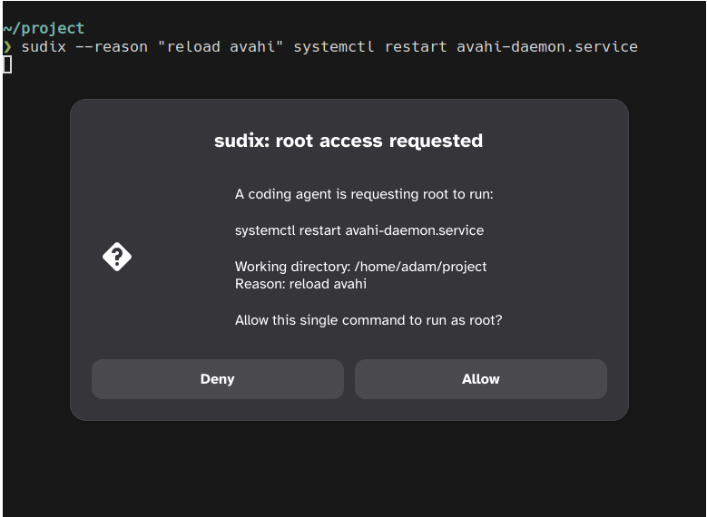

# sudix

**Let a coding agent run `sudo` safely.**

Your coding agent sometimes needs root: install a package, restart a service, edit a system file. The usual fixes are bad: a `NOPASSWD` sudoers line hands it unbounded, unattended root, and a stored password gives it a reusable root credential the moment it gets one approval.

sudix is built for exactly this. The agent doesn't get a credential-- it **asks** for one specific command, and you approve or deny that command with a single click. Approval covers that one command. The agent never sees a password and never gets a root shell.



## How it works

sudix runs a small root daemon (the **broker**). Your agent runs `sudix` instead of `sudo`. The broker:

1. **Checks policy** on a deny-by-default allowlist you control. Denied requests never bother you.
2. **Asks you** Pops up a desktop dialog (or a TOTP code, headless) showing the exact command. Any timeout or error means *deny*.
3. **Runs it** as root and returns the output.
4. **Logs** every decision.

### Why a broker, not a wrapper

Tools like [sudoplz](https://github.com/crypdick/sudoplz) wrap `sudo` on the *client* side: the agent's own process decides whether to proceed, and any guard it checks (working directory, parent process, environment) is forgeable by the agent. sudix moves the decision to a **separate root process** the agent can't influence. The agent can only send a request over a socket; policy, approval, and execution all happen on the other side of that boundary. One approval authorizes one command, not a session.

## Install

Requires Rust 1.95+, [`just`](https://github.com/casey/just), and `zenity` (for the desktop prompt). Then:

```sh
just install
```

This builds release binaries, installs them to `/usr/bin`, writes a starter `/etc/sudix/policy.toml` (if absent), installs the systemd units, and starts the broker plus the per-user approval agent.

Edit `/etc/sudix/policy.toml` (see below) and you're done.

To remove everything: `just uninstall`.

## Configure

Policy lives in `/etc/sudix/policy.toml` (root-owned, not world-writable). The daemon **hot-reloads** it whenever the contents change. A broken file is refused and the previous policy stays in effect.

### Policy schema

|Field |Where |Meaning |
|-|-|-|
|`agent_uids` |top level |uids allowed to submit requests (your agent's account). |
|`approver_uids` |top level |uids whose approval is accepted. |
|`deny` |top level |rules refused outright. **Checked before `allow`**. |
|`allow` |top level |rules that may be approved. |
|`cache_ttl_secs` |per allow rule |auto-approve identical argv for N seconds (default 0=off).|
|`rate_per_min` |per allow rule |max executions/min; over the limit → denied (0=off). |
|`method` |`[approval]` |`"agent"` (desktop) or `"totp"` (headless). |
|`totp_secret_path` |`[approval]` |secret file path; required when `method = "totp"`. |

A rule's `argv` is an ordered list of **token-matchers**, one per command token:

|Matcher |Matches |
|-|-|
|`"git"` |exactly that token (`argv[0]` is matched by basename). |
|`{ re = "…" }` |one token, by regex. Anchored automatically (`\S+` = one token).|
|`{ rest = true }`|zero or more trailing tokens; only valid as the last element. |

Commands with control characters (newline, tab, NUL) are always refused.

### Examples

```toml
# Allow installing packages, with any package args:
{ argv = ["pacman", "-S", { rest = true }] }

# Allow `systemctl restart <one-token>`:
{ argv = ["systemctl", "restart", { re = "\\S+" }] }

# Allow a single fixed command:
{ argv = ["id"] }

# Auto-approve repeats of the exact command for 5 minutes after one OK:
{ argv = ["pacman", "-Syu"], cache_ttl_secs = 300 }
```

**Allow everything** (you approve each command, but nothing is pre-denied):

```toml
allow = [{ argv = [{ rest = true }] }]
```

### Default config

`sudixd default-config` prints this:

```toml
# sudix policy -- generated by `sudix default-config`
#
# This file must be owned by root and not group- or world-writable.
#   sudo chown root:root /etc/sudix/policy.toml
#   sudo chmod 644 /etc/sudix/policy.toml   # or 640; not 666/664
#
# Each rule's `argv` is an ordered list of token-matchers:
#   "token"         bare string: exact match for one token (argv[0] by basename)
#   { re = "…" }    one token matched by an anchored regex (you write the inner
#                     pattern; sudix anchors it automatically: \S+ matches one
#                     whitespace-free token)
#   { rest = true } zero or more trailing tokens; valid only as the last element
#
# allow-all:              argv = [{ rest = true }]
# program with any args:  argv = ["prog", { rest = true }]
#
# deny is checked first and OVERRIDES allow.
# Arguments containing control characters (newline, tab, etc.) are always refused.

# Replace 1000 with the UID(s) of the agent and the human approver.
agent_uids    = [1000]
approver_uids = [1000]

# Deny rules. Overrides allow rules.
deny = [
  { argv = [{ re = "sh|bash|zsh|fish" }, { rest = true }] },
  { argv = [{ re = "dd|mkfs|fdisk|parted" }, { rest = true }] },
  { argv = [{ re = "tee|chmod|chown" }, { rest = true }] },
  { argv = [{ re = "visudo|su|sudo" }, { rest = true }] },
  { argv = ["env", { rest = true }] },
  { argv = [{ re = "vi|vim|nano" }, { rest = true }] },
  { argv = [{ re = "python|perl" }, { rest = true }] },
]

# Allow rules. Optional per-rule scoping (both default to 0 = off):
#   cache_ttl_secs = 300   # auto-approve identical argv for N seconds after one approval
#   rate_per_min   = 10    # max executions/min; over limit → denied
allow = [
  # { argv = ["systemctl", "status", { re = "\\S+" }] },
  # { argv = ["systemctl", "restart", { re = "\\S+" }] },
  { argv = ["id"] },
]

[approval]
# "agent" (per-user sudix-agent in the graphical session) or "totp" (headless).
method = "agent"
# totp_secret_path = "/etc/sudix/totp.key"   # required when method = "totp"
```

## Usage

Point your agent at `sudix` instead of `sudo`:

```sh
sudix --reason "install ripgrep" -- pacman -S --noconfirm ripgrep
```

A dialog shows you the exact command; approve or deny. The command runs as root
only if you approve.

## TOTP (headless)

On a machine with no graphical session, approve with a one-time code instead of
a dialog. In `/etc/sudix/policy.toml`:

```toml
[approval]
method = "totp"
totp_secret_path = "/etc/sudix/totp.key"
```

Enroll once and scan the printed `otpauth://` URI with an authenticator app:

```sh
sudixd enroll  # add --force to regenerate (invalidates old devices)
```

Then pass the current code with each request:

```sh
sudix --otp 123456 -- id
```

## More

Developer setup, architecture, and release details: [docs/DEVELOPMENT.md](docs/DEVELOPMENT.md).
